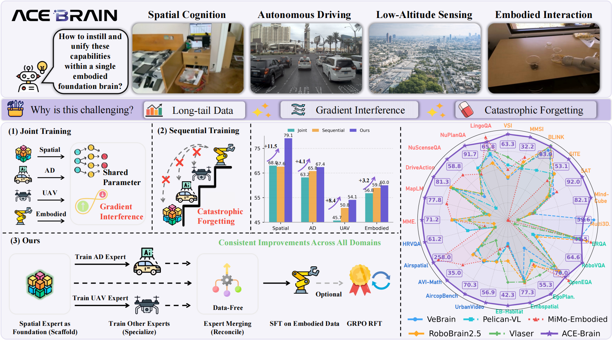

<div align="center">

<div align="center">
  
  <br>
</div>

# ACE-Brain: A Spatial-Centric Foundation Brain for Universal Embodiments


<p align="center">
  <a href="https://arxiv.org/abs/xxxx.xxxxx"></a>
  <a href="https://ace-brain.github.io"></a>
  <a href="https://huggingface.co/ACE-Brain"></a>
  <a href="https://opensource.org/licenses/Apache-2.0"></a>
</p>


</div>

<p align="center">
  
</p>

## 🚀 News 

- `2025/02/27`: 🔥 We open-source the model [ckpt](https://huggingface.co/ACE-Brain/ACE-Brain-8B/tree/main) and our technical report.

## 🧠 Abstract
**ACE-Brain** is the first spatial-centric generalist brain that unifies **spatial cognition**, **autonomous driving**, **low-altitude sensing**, and **embodied interaction** within a single multi-modal large language model (MLLM). 

Unlike traditional joint training that suffers from gradient interference or sequential training that incurs catastrophic forgetting, ACE-Brain introduces the **Scaffold-Specialize-Reconcile (SSR)** paradigm—establishing spatial intelligence as the universal bridge across heterogeneous embodiments.


## 🔥 Key Features

- **🧩 SSR Training Paradigm**: First pretrains a Spatial Expert as the shared anchor, then branches into isolated domain specialists, and finally reconciles via data-free merging.
- **🏆 State-of-the-Art Performance**: Competitive or leading results on **24 benchmarks** spanning spatial intelligence, autonomous driving, UAV perception, and embodied interaction

## 📊 Performance Highlights

ACE-Brain-8B achieves superior performance across four domains:

| Domain | Benchmark | ACE-Brain-8B | Best Baseline | Delta |
|:------:|:---------:|:------------:|:-------------:|:-----:|
| **Spatial** | SAT | **92.0** | 79.3 (Gemini-2.5-Pro) | **+12.7** |
| **Spatial** | MindCube | **82.1** | 52.2 (Gemini-2.5-Pro) | **+29.9** |
| **AD** | NuPlanQA | **91.7** | 81.5 (GPT-4o) | **+10.2** |
| **AD** | MME-RealWorld | **71.2** | 67.0 (Gemini-2.5-Pro) | **+4.2** |
| **UAV** | UrbanVideo-Bench | **56.9** | 45.5 (Qwen-VL-Max) | **+11.4** |
| **UAV** | AircopBench | **70.3** | 51.8 (GPT-4o) | **+18.5** |
| **Embodied** | RoboVQA | **64.6** | 34.5 (GPT-4o) | **+30.1** |
| **Embodied** | EgoPlan-Bench2 | **55.3** | 44.7 (Qwen-VL-Max) | **+10.6** |


## 🚀 Quick Start

### Installation

```bash
conda create -n acebrain python=3.10
conda activate acebrain
pip install torch torchvision torchaudio
pip install -e .
```
### Inference Example

```python
from transformers import AutoModelForCausalLM, AutoTokenizer
from PIL import Image

# Load model
model = AutoModelForCausalLM.from_pretrained(
    "ACE-Brain/ACE-Brain-8B",
    torch_dtype="auto",
    device_map="auto"
)
tokenizer = AutoTokenizer.from_pretrained("ACE-Brain/ACE-Brain-8B")

# Multi-view autonomous driving example
images = [Image.open(f"view_{i}.jpg") for i in range(6)]  # Surround-view cameras
question = "What is the future state of the black vehicle in the middle?"

msgs = [{'role': 'user', 'content': [question] + images}]
response = model.chat(tokenizer, msgs)
print(response)  # "The black vehicle will keep going straight."
```


## 🗓️ Roadmap
PRs welcome! 🤗
- [√] **ACE-Brain v1.0**: SSR paradigm with 4-domain unification
<!-- - [ ] **ACE-Brain-VLA**: Continuous visuomotor policy generation (diffusion/flow-matching)
- [ ] **ACE-Brain 2.0**: Physics-infused continuous cognition with sub-pixel metric localization
- [ ] **Meta-Embodiment**: Few-shot adaptation to novel robot morphologies via scaffold alignment -->


## 📖 Citation

If you find ACE-Brain useful for your research and applications, please consider citing:

```bibtex
@article{gong2026acebrain,
  title={ACE-Brain: A Spatial-Centric Foundation Brain for Universal Embodiments},
  author={Gong, Ziyang and Luo, Zehang and Tang, Anke and Liu, Zhe and others},
  journal={arXiv preprint arXiv:2502.xxxxx},
  year={2026}
}
```


## 🙏 Acknowledgements

This project is built upon [Qwen3-VL](https://github.com/QwenLM/Qwen3-VL) and benefits from the open-source embodied AI community. We thank the authors of [VSI-Bench](https://github.com/vision-x-nyu/thinking-in-space), [NuScenes](https://github.com/nutonomy/nuscenes-devkit), and [EgoPlan](https://github.com/ChenYi99/EgoPlan) for their excellent benchmarks.

## 👥 Contributors

<a href="https://github.com/ACE-Brain-Team/ACE-Brain/graphs/contributors">
  
</a>

## ⭐ Star History

<a href="https://star-history.com/#ACE-Brain-Team/ACE-Brain&Date">
 <picture>
   <source media="(prefers-color-scheme: dark)" srcset="https://api.star-history.com/svg?repos=ACE-Brain-Team/ACE-Brain&type=Date&theme=dark" />
   <source media="(prefers-color-scheme: light)" srcset="https://api.star-history.com/svg?repos=ACE-Brain-Team/ACE-Brain&type=Date" />
   
 </picture>
</a>

